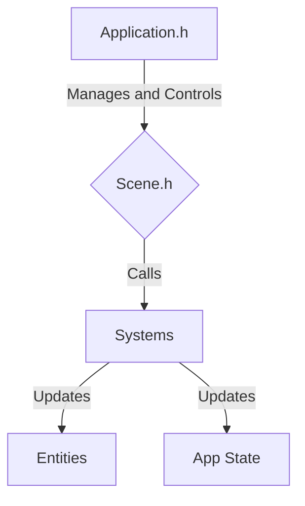

## GUI_Element class
```C++
class GUI_Element{
public:
GUI_Element();
bool isHighlighted(sf::Vector2f position);
void onClick();
private:
sf::FloatRect border;
sf::Sprite sprite;
}
```
---
# DO NOT WORRY ABOUT ENTITY CREATION THROUGH THE MAP FILE!!! JUST READ IN THE MAP FILE AND GENERATE THE REST WITH CODE!!!!!!!!!
<font style="color: red; font-size: 25px">Change entire map file to JSON</font>

---
# Engine Files
---
- So the hierarchy is as follows

---

## AppCore
- Contains the Cast-A-Ray Application Framework main files
	- `Core.h`
	- `Application.h`
	- `Core.h`
	- `Scene.h`
	- `System.h`
	- `Systems.h`
## GameEnCore (Game Engine Core)
- Contains all the necessary files, classes, and structs to start creating games
	- `Actor.h`
	- `Components.h`
	- `Entity.h`
	- `SFMLMath.hpp`


